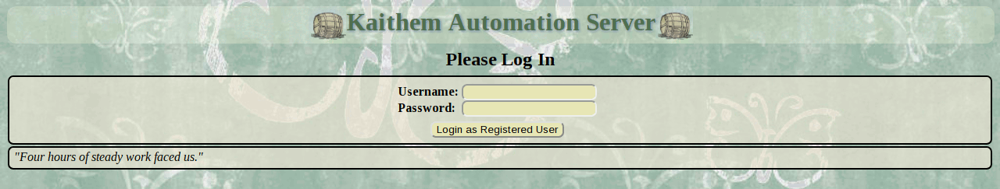
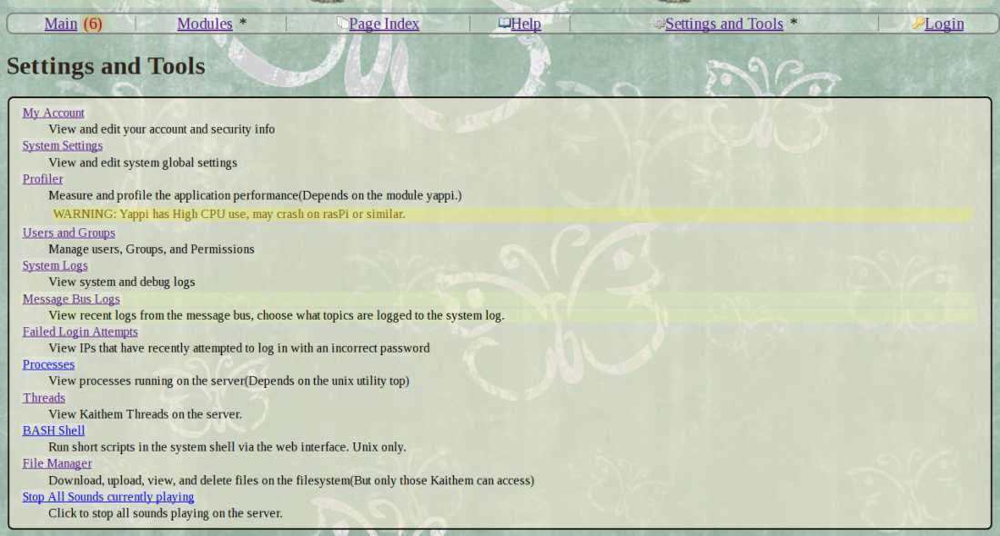
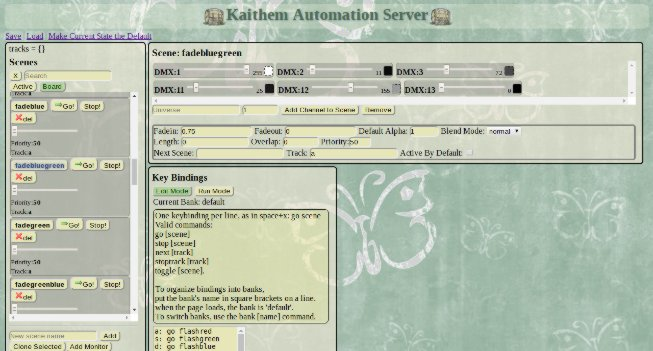

Kaithem is Linux home/commercial automation server written in pure python, HTML, Mako, and CSS. It's more low level than your average HA system, but it allows you to control anything python can.

Kaithem uses a user/group/permission system with SSL support, and is designed to be fairly secured. I'm not a security researcher, but it should at the very least keep casual snoopers on the LAN out.

It runs on python3, but it is not tested outside of Linux. Resource usage is low enough to run well on the Raspberry Pi.

You automate things by directly writing python and HTML via a web IDE. "Events" are sections of code that run when a trigger condition happens. Trigger conditions can be polled expressions, internal message bus
events, or time-based triggers using a custom semi-natural language parser.

Almost the entire server state is maintained in RAM, and any changes you make to your code never touches the disk unless you explicitly save or configure auto-save.

Saving occurs transactionally, so a copy of the state of the server is made before changing the new one. The save formats for events and pages is just python code and HTML/markdown, making it easy to edit by hand.

You can update systems by downloading and uploading events and pages as zip files(Grouped into "modules), making deployment easy.

There's a built in realtime websocket-based log viewer to assist with debugging, and several features to make detecting intrusions and errors easier.

Kaithem includes a library for common automation tasks such as file IO, timing, executing functions in the background, formatting numbers, and more, including a graphical lighting console and a mixing board supporting multiple soundcards!

Kaithem is still beta, but I've used it in production applications running for months at a time. 

It wasn't designed for any kind of safety-critical application, but it is meant to be reliable enough for most home and commercial applications.

Installation
============

## Documentation
Kaithem's help files are being migrated to markdown. You can browse right on github,
or access the full help via the web interface!
*  [help](kaithem/src/docs/help.md)
*  [FAQ(old)](kaithem/src/docs/faq.md)

## Setup
See [This page](kaithem/src/docs/setup.md). Or, to just try things out, git clone and run kaithem/kaithem.py, then visit port 8001(for https) or port 8002(for not-https) on localhost. That's really all you need to do.

There are many optional dependancies in the .deb recommended section that enable extra features. All are available in the debian
repos and do not need to be compiled, except for Cython, which is installed automatically by the postinstall script of the debian package, or can easily be manually installed with "sudo pip3 install Cython".

At the moment, Cython is only used to give audio mixer gstreamer threads realtime priority.

In particular, everything to do with sound is handled by dependancies, and python3-libnacl and python3-netifaces are recommended as several networking features require them.

### Security
At some point, you should probably set up a proper SSL certificate in kaithem/var/ssl. The debian installer will generate one at
/var/lib/kaithem/ssl/certificate.key that you can replace with a real one if you don't want to go self-signed.

Recent Changes(See [Full Changelog](kaithem/src/docs/changes.md))
=============

### 0.64
- Option to open port with UPnP
- Built in UPnP scanner to detect security issues
- Full copy of the python3.8 documentation available locally in the help section
- Sound Mixer built in(if using JACK)
- Lightboard better suited for media
- Dynamic Fixture Mapping in Lightboard
- If the server is restarted but the system itself remains running, all module and registry changes persist in RAM
    on linux.
- Many bugfixes
- Boot time is several times faster
- No limit to event traceback stack depth
- Remove posting to /system/threads/start, it created a refactoring nightmare and wasn't useful
- Remove system/errors/workers for the same reason, traditional logging makes it obsolete.
- Hopefully resolved the SSL segfault
- Auto-adopt stuff to the default kaithem user if started as root(Useful if things are modified by sudo)
- Minor breaking: Resources all have file extensions, old loaded modules may have odd names but will load
- Events are now stored as standard python files with data in variables, for easy viewing in external editors
- New kaithem.web.controllers: Easily create pages directly in python code using cherrypy directly without losing the flexibility of Kaithem.
- WiFi Manager, on Linux with NetworkManager you can set up connections to access points via
  the web UI.
- `__del__` support in events, just define it in the setup.
- kaithem.midi.FluidSynth lets you play MIDI notes with soundfonts
- One-param and zero-param messagebus subscriptions that don't get the topic(Two param stil works)
- gpiozero integration
- Util page for viewing environment variables
- Lightboard scenes are now saved to VARDIR/chandler/scenes/SCENENAME.yaml
- Functions can now be used as StateMachine rules, they are polled and followed when true
- Use Ace code editor as fallback on mobile
- Lightboard has been renamed to Chandler
- Add a bit of runtime type checking

### 0.63

-   New tagpoints(Like SCADA tagpoints) with Pavillion sync to Arduino
-   Kasa smartplug support
-   Migrate docs to markdown
-   Message bus can handle any python object type
-   Workarouds for the "Too many open file descriptors" issues.
-   Major MDNS and NTP improvements
-   MDNS browsing page
-   QR Code display in about page
-   Proper cache support for favicon
-   Notifications use websockets, not polling
-   Lighting subsystem improvements
-   Logging bugfixes

License Terms
=============
The original python code and and the HTML files under /pages are licensed under the GNU GPL v3.
However, Kaithem includes code copied unmodifed from many other open source projects. under various licenses. This code is generally in a separate folder and accompanied by the corresponding license.

Some images used in theming are taken from this site: http://webtreats.mysitemyway.com/ and may be considered non-free
by some due to a restriction on "redistribution as-is for free in a manner that directly competes with our own websites."
However they are royalty free for personal and commercial use ad do not require attribution, So I consider them appropriate
for an open project

Some icons from the silk icon set(http://www.famfamfam.com/lab/icons/silk/) have also been used under the terms of the Creative Commons Attribution license.
