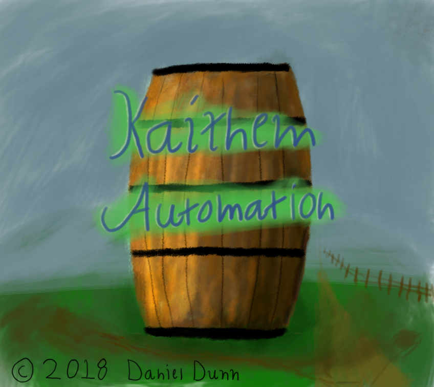
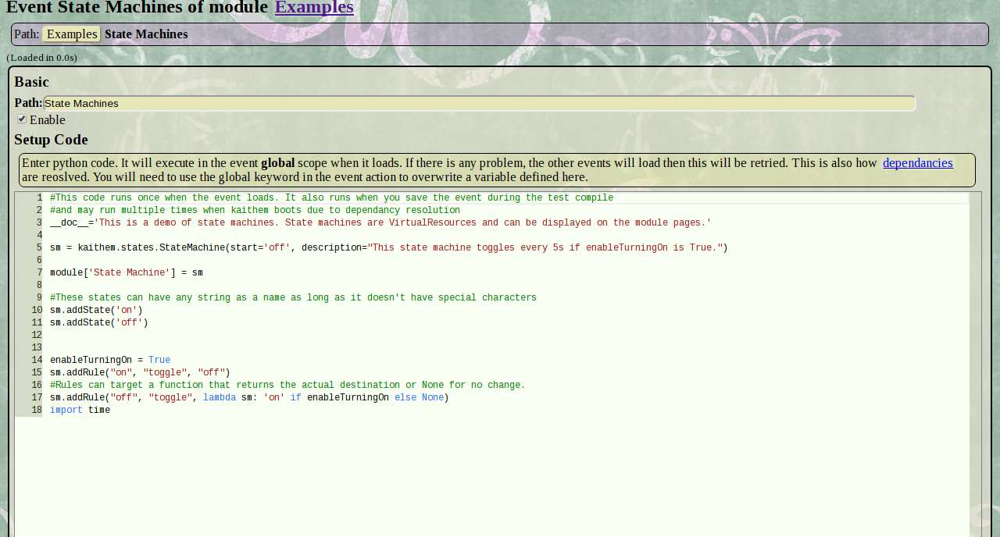
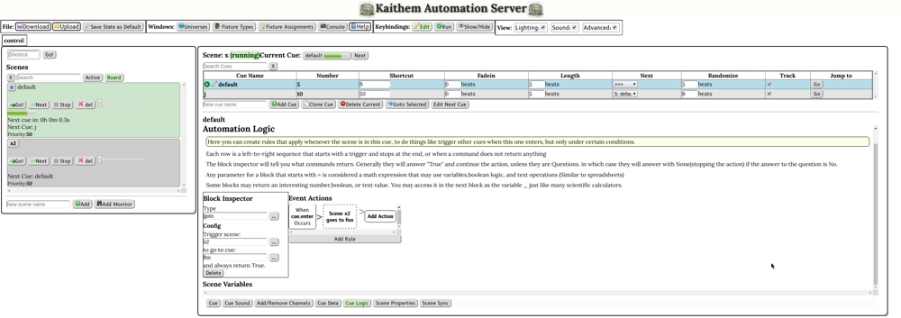

Kaithem is Linux home/commercial automation server written in pure python, HTML, Mako, and CSS. It's more low level than your average HA system, but it allows you to control anything python can.

It runs on python3, but it is not tested outside of Linux. Resource usage is low enough to run well on the Raspberry Pi.

You automate things by directly writing python and HTML via a web IDE. "Events" are sections of code that run when a trigger condition happens. Trigger conditions can be polled expressions, internal message bus
events, or time-based triggers using a custom semi-natural language parser.

Almost the entire server state is maintained in RAM, and any changes you make to your code never touches the disk unless you explicitly save or configure auto-save.

Kaithem also includes a module called Chandler, which is a full web-based lighting control board with a visual
programming language for advanced interactive control.

Kaithem is still beta, but I've used it in production applications running for months at a time. 

It wasn't designed for any kind of safety-critical application, but it is meant to be reliable enough for most home and commercial applications.

Installation
============

## Documentation
Kaithem's help files are being migrated to markdown. You can browse right on github,
or access the full help via the web interface!
*  [help](kaithem/src/docs/help.md)
*  [FAQ(old)](kaithem/src/docs/faq.md)

## Setup
See [This page](kaithem/src/docs/setup.md). Or, to just try things out, git clone and run kaithem/kaithem.py, then visit port 8001(for https) or port 8002(for not-https) on localhost. That's really all you need to do.

There are many optional dependancies in the .deb recommended section that enable extra features. All are available in the debian repos and do not need to be compiled, except for Cython, which is installed automatically by the postinstall script of the debian package, or can easily be manually installed with "sudo pip3 install Cython".

At the moment, Cython is only used to give audio mixer gstreamer threads realtime priority.

In particular, everything to do with sound is handled by dependancies, and python3-libnacl and python3-netifaces are recommended as several networking features require them.

### Security
At some point, you should probably set up a proper SSL certificate in kaithem/var/ssl. The debian installer will generate one at
/var/lib/kaithem/ssl/certificate.key that you can replace with a real one if you don't want to go self-signed.

### Debugging

It shouldn't happen, but if things get real messed up, use SIGUSR1 to dump hte state of all threads to /dev/shm/
"killall -s USR1 kaithem" works if you have setproctitle.

#### with GDB
If using GDB python, you may need to use "handle SIG32 nostop" to suppress abboying notifications:

gdb python3
$handle SIG32 nostop
$run YOUR_KAITHEM_PY_FILE

Recent Changes(See [Full Changelog](kaithem/src/docs/changes.md))
=============

### 0.65.58
- DrayerDB integration can now log system notifications
- DrayerDB configurable autoclean for old notifications.
- Update drayerDB, properly support compressed records.
- Breaking change: Zigbee device property tagpoints use .property instead of /property format

### 0.65.57
- Tag point timestamp correctly starts at 0 when not yet set by anything
- Zigbee2MQTT Alarm Bugfixing
- Use prompt instead of text input to prevent browser caching sensitive info in DrayerDB sharing codes

### 0.65.56
- Update HardlineP2P

### 0.65.55
- Tag history DB file now includes the name of the node that wrote it.
- Semi breaking change, not really, the log directory is now compartmented by which hostname-user actually wrote the logs, in case the vardir is synced between machines.
- File manager now includes a youtube-dl frontend, for legal purposes only.
- Ability to ship device drivers inside a module, with proper dependency resolution on boot.
- Include pure python fallback for messagepack
- New BinaryTag tagpoint type
- Fix error when re-saving event with exposed tag
- Zigbee2MQTT is now supported.  Add the Zigbee daemon as a device type and most supported devices should show up as tag points.
- DrayerDB is now supported. Kaithem is now the preferred way to manage DrayerDB servers.

### 0.65.54
- More nuisance errors removed
- Assume that YeeLight bulbs have a good connection until proven otherwise, to avoid alarms. In the future the whole YeeLight module should be refactored.

### 0.65.53
- Workaround for JACK bug on raspberry pi. We always set playback to 2 channels.  This is a minor regression, it will not support the full channel count for surround, and may crash if there is only 1 output channel.  However, the risk of adding more bugs with a more copmplex solution to the audio nightmare, is probably not worth it.
- Fix nuisance selftest error
- Fix nuisiance wifi signal alert
- Remove the WebRTC voice DSP which has not been stable and can segfault.
- Restore support for Python3.7

### 0.65.52
- Even MORE work to be compatible with the odd IPs chrome uses when you use HTTP localhost.

### 0.65.51
- Alarms on =expression tags work properly
- Widget IDs no longer (rarely) generate invalid characters
- Remove some more unused code
- Eliminate confusing content on file resource pages
- Fix some nuisance error messages

### 0.65.50
- /sky/civilTwilight tag fixed

### 0.65.49
- Fix HTTP localhost access when used with IPv6 ::1
- Fix auto-redirect that would sometimes take you to the wrong page after login
- Fix auth cookies not working on localhost(Note: We assume all localhost connections are secure. Don't build a some weird proxy that breaks that assumption.)
- Secure widgets now work correctly via localhost
- Configuring tag point intervals now takes effect immediately
- You can now use an =expression as a tag point fixed config overrride.
- General refactoring and reliability for Tagpoints

License Terms
=============
The original python code and and the HTML files under /pages are licensed under the GNU GPL v3.
However, Kaithem includes code copied unmodifed from many other open source projects. under various licenses. This code is generally in a separate folder and accompanied by the corresponding license.

Some images used in theming are taken from this site: http://webtreats.mysitemyway.com/ and may be considered non-free
by some due to a restriction on "redistribution as-is for free in a manner that directly competes with our own websites."
However they are royalty free for personal and commercial use ad do not require attribution, So I consider them appropriate
for an open project

Some icons from the silk icon set(http://www.famfamfam.com/lab/icons/silk/) have also been used under the terms of the Creative Commons Attribution license.
