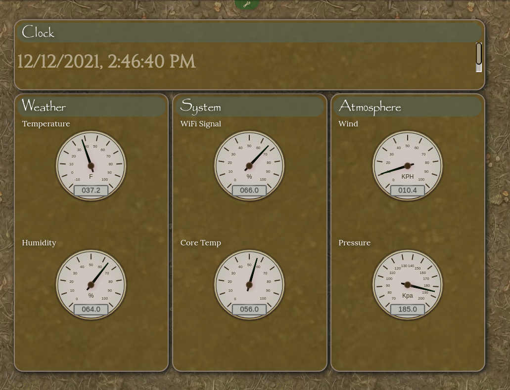
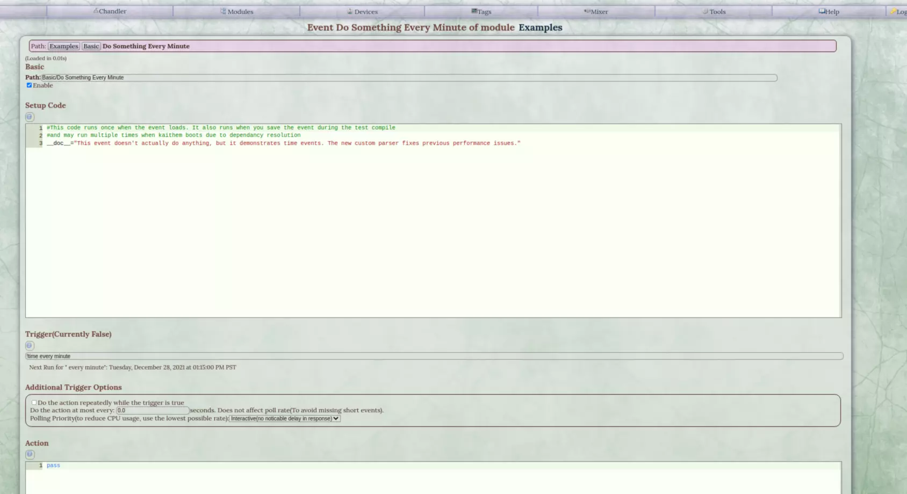
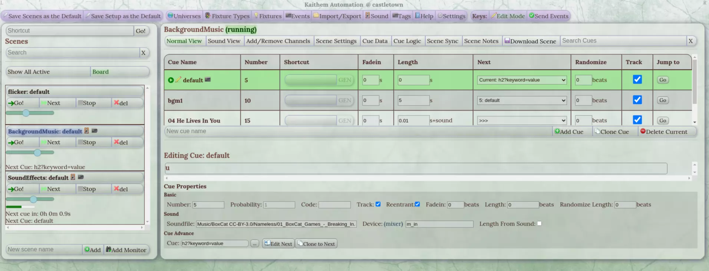

Kaithem is Linux home/commercial automation server written in pure python, HTML, Mako, and CSS. It's more low level than your average HA system, but it allows you to control anything python can.

It runs on python3, but it is not tested outside of Linux. Resource usage is low enough to run well on the Raspberry Pi.

You automate things by directly writing python and HTML via a web IDE. "Events" are sections of code that run when a trigger condition happens. Trigger conditions can be polled expressions, internal message bus
events, or time-based triggers using a custom semi-natural language parser.




Almost the entire server state is maintained in RAM, and any changes you make to your code never touches the disk unless you explicitly save or configure auto-save.




Kaithem also includes a module called Chandler, which is a full web-based lighting control board with a visual
programming language for advanced interactive control.

Kaithem is still beta, but I've used it in production applications running for months at a time. 

It wasn't designed for any kind of safety-critical application, but it is meant to be reliable enough for most home and commercial applications.

Installation
============

## Documentation
Kaithem's help files are being migrated to markdown. You can browse right on github,
or access the full help via the web interface!
*  [help](kaithem/src/docs/help.md)
*  [FAQ(old)](kaithem/src/docs/faq.md)


## Setup
See [This page](kaithem/src/docs/setup.md). Or, *to just try things out, git clone and run kaithem/kaithem.py, then visit port 8001(for https) or port 8002(for not-https) on localhost. That's really all you need to do.*

There are many optional dependancies in the .deb recommended section that enable extra features. All are available in the debian repos and do not need to be compiled, except for Cython, which is installed automatically by the postinstall script of the debian package, or can easily be manually installed with "sudo pip3 install Cython".

At the moment, Cython is only used to give audio mixer gstreamer threads realtime priority.

In particular, everything to do with sound is handled by dependancies, and python3-libnacl and python3-netifaces are recommended as several networking features require them.

Several other audio file players may still work, but the only one supported and suggested is libmpv, on Debian provided by libmpv-dev.


## To install all required and optional dependencies 

```bash
sudo apt install python3 cython3 build-essential python3-msgpack python3-future apt install python3-serial  python3-tz  python3-dateutil  lm-sensors  python3-netifaces python3-jack-client  python3-gst-1.0  python3-libnacl  jack-tools  jackd2  gstreamer1.0-plugins-good  gstreamer1.0-plugins-bad  swh-plugins  tap-plugins  caps   gstreamer1.0-plugins-ugly  python3-psutil  fluidsynth libfluidsynth2  network-manager python3-paho-mqtt python3-dbus python3-lxml gstreamer1.0-pocketsphinx x42-plugins baresip autotalent libmpv-dev python3-dev  libbluetooth-dev libcap2-bin rtl-433  python3-toml  python3-rtmidi python3-pycryptodome  gstreamer1.0-opencv  gstreamer1.0-vaapi python3-pillow python3-scipy
```

If on intel you will probably want intel-opencl-icd for a bit faster inferrence when doing object detection.

### Systemd service

Ajdust as needed  to point to your paths and users.  Or just use emberos.

Leave of the pw-jack in the front of ExecStart if you do not have PipeWire(If not on a Red Hat system or EmberOS, you likely don't yet as of now)

```ini
[Unit]
Description=KaithemAutomation python based automation server
After=basic.target time-sync.target sysinit.service zigbee2mqtt.service pipewire.service
Type=simple


[Service]
TimeoutStartSec=0
ExecStart=pw-jack /opt/kaithem/kaithem/kaithem.py -c /home/pi/kaithem/config.yaml
Restart=on-failure
RestartSec=15
OOMScoreAdjust=-800
Nice=-15
#Make it try to act like a GUI program if it can because some modules might
#make use of that.  Note that this is a bad hack hardcoding the UID.
#Pipewire breaks without it though.
Environment="DBUS_SESSION_BUS_ADDRESS=unix:path=/run/user/1000/bus"
Environment="XDG_RUNTIME_DIR=/run/user/1000"

#This may cause some issues but I think it's a better way to go purely because of
#The fact that we can use PipeWire instead of managing jack, without any conflicts.

#Also, node red runs as pi, lets stay standard.
User=pi
#Bluetooth scannning and many other things will need this
#Setting the system time is used for integration with GPS stuff.
AmbientCapabilities=CAP_NET_BIND_SERVICE CAP_NET_ADMIN CAP_NET_RAW CAP_SYS_TIME CAP_SYS_NICE
SecureBits=keep-caps

LimitRTPRIO= 95
LimitNICE= -20
LimitMEMLOCK= infinity


StandardOutput=journal
StandardError=journal

[Install]
WantedBy=multi-user.target

```

# To download all optional dependancies

See helpers/debianpackaging/CONTROL for the list

## Installing Object Detection

The NVRChannel plugin uses the full YOLOv3 model, until such a time as I can get a lighter model to work.  It needs these two files:
https://pjreddie.com/media/files/yolov3.weights
and 
https://github.com/arunponnusamy/object-detection-opencv/raw/master/yolov3.cfg

To be in one of several locations.

'/home/USER/.cvlib/object_detection/yolo/yolov3'
'/usr/share/pjreddie_darknet/yolov3_coco'

Note that if you have ever used the cvlib library it auto downloads in /home/USER/.cvlib/object_detection/yolo/yolov3
And also, the files are already included in EmberOS.

### Security
At some point, you should probably set up a proper SSL certificate in kaithem/var/ssl. The debian installer will generate one at
/var/lib/kaithem/ssl/certificate.key that you can replace with a real one if you don't want to go self-signed.


### Debugging

It shouldn't happen, but if things get real messed up, use SIGUSR1 to dump hte state of all threads to /dev/shm/
"killall -s USR1 kaithem" works if you have setproctitle.

#### with GDB
If using GDB python, you may need to use "handle SIG32 nostop" to suppress abboying notifications:

gdb python3
$handle SIG32 nostop
$run YOUR_KAITHEM_PY_FILE


Recent Changes(See [Full Changelog](kaithem/src/docs/changes.md))
=============

### 0.68.14
- Fix bug where NVRChannel would carry over record sessions and thereby crash and not be able to recover from connection failure
- Improve nvr time search
- 
### 0.68.13
- NVRChannel can now use scipy for way better performance on erosion operations.

### 0.68.12
- NVRChannel can now auto reconnect after a network problem.

### 0.68.11
- Minor tweak to the motion detection algorithm for enhanced resistance to  low level noise.
- Water ripple filter now uses alpha blending for better realism.

### 0.68.10
- BREAKING: NVRPlugin no longer uses a sensitivity value. We have a custom detector and we use a threshold value now
- NVRChannel now reports the raw "level" of motion
- NVRChannel uses a custom motion algorithm that requires Pillow, based on RMS and erosion.
- Retriggering recording in NVRChannel before recording is finished will just append to the active recording
- NVRChannel should no longer crash if you delete a segment dir while it is being written to


### 0.68.9
- Any module page can now be accessed via it's subfolder
- No more H1 header at the top of most pages, to save screen space
- Dropdown panel to keep an eye on notofications from any page
- Manual and motion-activated NVR recording
- Beholder frontend module for a simplified view of the NVR
- 
### 0.68.8

- New Fugit SciFi inspired theme
- NVRPlugin has been rewritten to give low latency streaming over websockets.  It still doesn't have recording, but likely will.
- New unreliable mode for tag points to support this kind of media.
- User telemetry hidden on admin page unless you explicitly press "show"
- Unlogged realtime only telemetry now includes user idle state if permission has been granted, to check on digital signage and kiosks.
- Easier selection of the builtin themes
- Icons switched to the IcoFont for more standardization
- Improve mobile support

### 0.68.7

- Admin can see battery status of all connected devices if said device supports it
- Admin can remotely refresh any client page
- Enabling telemetry alerts for an account will raise an alarm when an associated kiosk device browser hs low battery(Chrome/Chromium only, FF killed the API on others)

### 0.68.6

- Poll every hour to find any disks that may be above 90% full and raise an alarm automatically about this.
- Disk usage status on about page

### 0.68.5

- Compatibility with newer Linux Mint
- Midi last note tags fixed
- Compatibility with yet another RTMidi variant


License Terms
=============
The original python code and and the HTML files under /pages are licensed under the GNU GPL v3.
However, Kaithem includes code copied unmodifed from many other open source projects. under various licenses. This code is generally in a separate folder and accompanied by the corresponding license.

Some images used in theming are taken from this site: http://webtreats.mysitemyway.com/ and may be considered non-free
by some due to a restriction on "redistribution as-is for free in a manner that directly competes with our own websites."
However they are royalty free for personal and commercial use ad do not require attribution, So I consider them appropriate
for an open project

Some icons from the silk icon set(http://www.famfamfam.com/lab/icons/silk/) have also been used under the terms of the Creative Commons Attribution license.
